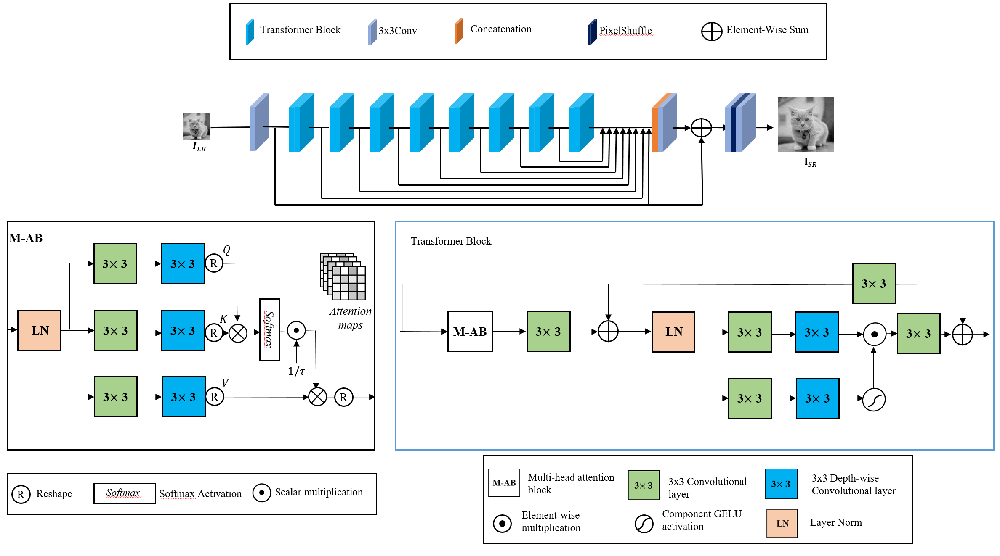

# MCT: Multi-Connection Transformer
[The Van LE](https://vvvanthe.github.io), [Jin Young LEE](https://sites.google.com/view/ivcl/research?authuser=0/)

Intelligent Visual Computing Laboratory (IVCL), South Korea

---


This repository is the official PyTorch implementation of MCT: Multi-Connection Transformer
- lighweight/real-world image SR
</br>


---

> In this study, we introduce a lightweight super-resolution model based on the Transformer architecture, tailored to the specific task of enhancing the resolution of images. Super-resolution is a critical task in computer vision, with applications ranging from improving image quality to enhancing the clarity of low-resolution images.
><p align="center">
  
</p>


#### Contents


1. [Testing](#Testing)
1. [Results](#Results)


## Testing (without preparing datasets)
For your convience, we provide some example datasets in `/testsets`. 
If you just want codes, downloading `models/network_mct.py`, `utils/util_calculate_psnr_ssim.py` and `main_test.py` is enough.


```bash
# (setting1: when model is trained on DIV2K and with training_patch_size=48)
python main_test.py --model mct --scale 2  --model_path model_zoo/mct.pth --folder_lq testsets/LR/LRBI/set5/x2/ --folder_gt testsets/HR/set5/x2/
```

---

## Results
We achieved better performance when compared to [EDSR](https://github.com/sanghyun-son/EDSR-PyTorch), [CARN](https://github.com/nmhkahn/CARN-pytorch), and [FALSR-A](https://github.com/xiaomi-automl/FALSR).


  
- More detailed comparison between MCT and a representative CNN-based model EDSR, CARN and FALSA-A (classical image SR, X2, no compression)

| Method                                               | Training Set    | #Params | Y-PSNR/Y-SSIM <br /> on Set5 | Y-PSNR/Y-SSIM <br /> on Set14 | Y-PSNR/Y-SSIM <br /> on BSD100 | Y-PSNR/Y-SSIM <br /> on Urban100 | Y-PSNR/Y-SSIM <br /> on Manga109 |
|:-----------------------------------------------------| :---:        |:-------:|:----------------------------:|:-----------------------------:|:------------------------------:|:--------------------------------:|:--------------------------------:|
| [CARN](https://github.com/nmhkahn/CARN-pytorch)      | DIV2K |  1.6M   |         37.76/0.9590         |         33.52/0.9166          |          32.09/0.8978          |           31.92/0.9256           |           38.36/0.9765           | 
| [EDSR](https://github.com/sanghyun-son/EDSR-PyTorch) | DIV2K |  1.4M   |         37.77/0.9598         |         33.36/0.9157          |          32.05/0.8980          |           31.55/0.9228           |           38.01/0.9757           | 
| [FALSR-A](https://github.com/xiaomi-automl/FALSR)    | DIV2K |  1.0M   |       37.82/0.9595	       |      33.55/0.9168        |          32.12/0.8987          |         31.93/0.9256       |              --/--               | 
| MCT                                                  | DIV2K |  0.9M   |       **37.99/0.9605**       |       **33.56/0.9181**        |        **32.15/0.8993**        |         **32.11/0.9281**         |         **38.76/0.9773**         | 


